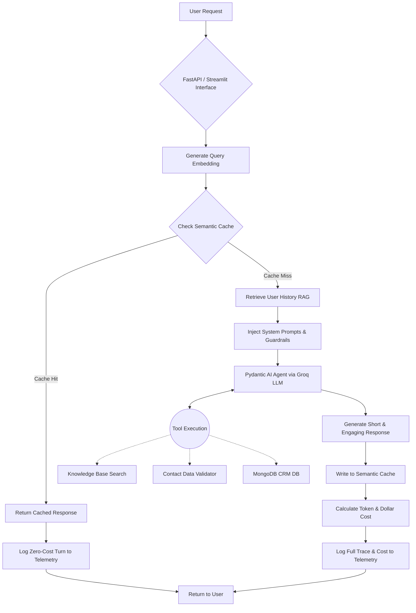

# Kayfa AI Sales Agent

A high-performance, cost-optimized conversational AI designed to convert leads, recommend educational courses, and securely capture customer data into a CRM. Built for scale, speed, and strict operational compliance.

## What is New: The Architecture Upgrades

We overhauled the system to focus heavily on cost reduction, extreme observability, and production-ready scalability.

### 1. Granular Cost Tracking & Telemetry
Complete visibility into every fraction of a cent spent. 
* **Per-Turn Pricing:** The Behavior & Trace Monitor now groups interactions by session, showing the exact dollar cost of every single message, alongside the total session and total user spend.
* **Tool Transparency:** The trace monitor captures and displays the exact arguments passed to tools and the raw data returned, making debugging and auditing instant.

### 2. Radical Cost Reduction
* **Semantic Caching:** Integrated a vector-based Semantic Cache. If a user asks a similar question, the system intercepts the request and serves the cached response, dropping LLM inference costs to zero for that turn.
* **Token Pruning:** Memory management now forcefully prunes older conversational context to prevent token bloat during long sessions.

### 3. Dynamic Cost Estimation
A built-in scaling matrix allows administrators to simulate monthly active users (MAU) and conversation lengths. It calculates projected API bills by factoring in dynamic input costs and Groq's 50% discount on cached static prefix tokens.

### 4. Headless FastAPI Integration
The entire agentic engine is now wrapped in a clean, production-ready FastAPI endpoint (`/chat`). The system is fully decoupled from the Streamlit UI, meaning you can instantly plug this agent into WhatsApp, custom web apps, or mobile frontends.

### 5. Sharper Agent Behavior
The agent's system prompts have been re-engineered. Responses are now strictly short, engaging, and conversational. It avoids walls of text, gets straight to the point, and aggressively but politely pushes for lead capture and data validation.

## Production Workflow Architecture

Below is the execution flow of a single user request through the optimized Kayfa architecture.



## Running the API

Start the FastAPI server for backend integrations:
```bash
uvicorn api:app --reload --port 8000
```

Start the Streamlit Admin & Chat UI:
```bash
streamlit run app.py
